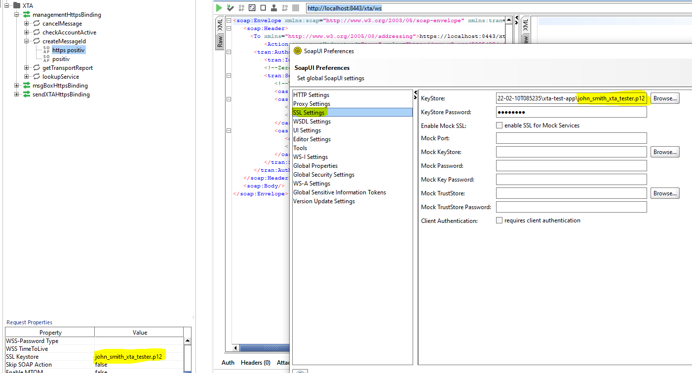

= Bedienungsanleitung
:toc:
:toc-title: Inhalt
:toclevels: 3
:docinfo: shared

In diesem Dokument wird die Verwendung des XTA Konformitätstesters beschrieben.

== Starten der Anwendung

=== Voraussetzungen

Zum Starten der Anwendung wird mindestens ein Java in der Version 17 benötigt.
Ist keine entsprechende Java Version verfügbar, dann kann von der https://adoptium.net/[Adoptium]
Seite ein OpenJDK heruntergeladen werden.

Können nicht die mitgelieferten Zertifikate und Keystores verwendet werden, dann sind in der Datei *application-local.yml* die entsprechenden Konfigurationsparameter anzupassen.
Das Erstellen von KeyStores und TrustStores ist innerhalb des Themas
xref:erstellen_von_zertifikaten.adoc["Erstellen von Zertifikaten"] beschrieben.

=== Konfigurationsparameter

Die Konfiguration ist in der *application-local.yml* und einer *config.yaml* Datei abgelegt.
Die Anwendung verwendet den Port 8080 und den Port 8443 als Standard.
Sind diese Ports schon belegt, dann sind die entsprechenden Konfigurationsparameter anzupassen.
Sofern die Datei *config.yaml* nicht existiert, so wird diese beim ersten Start der Anwendung erstellt.

==== Konfiguration in der application*.yml

|===
| Konfigurationsparameter | Beschreibung

| server.port | Https Port der Anwendung
| server.ssl.key-store | Pfad zum KeyStore. Dieser enthält den privaten und öffentlichen Schlüssel der Anwendung
| server.ssl.key-store-password | Passwort des KeyStores
| server.ssl.key-alias | Alias im KeyStore
| server.ssl.key-password | Passwort für den Schlüssel im KeyStore
| server.ssl.trust-store | Pfad zum TrustStore. Dieser enthält alle vertrauenswürdigen Zertifikate oder Oberzertifikate
| server.ssl.trust-store-password | Password des TrustStores
| app.server.http-port | Http Port der Anwendung
| logging.level.ROOT | Generelles Log-Level der Anwendung
| logging.level.<Paketname> | Loglevel für ein Paket und dessen Kinder festlegen

|===

==== Konfiguration in der config.yaml

|===
| Konfigurationsparameter | Beschreibung

| protocolMetadata.softwareManufacturer | Hersteller des zu testenden Produkts
| protocolMetadata.softwareName | Name des zu testenden Produkts
| protocolMetadata.softwareVersion | Version des zu testenden Produkts
| protocolMetadata.street | Firmenadresse (Straße) des Herstellers des zu testenden Produktes
| protocolMetadata.streetNo | Firmenadresse (Hausnummer) des Herstellers des zu testenden Produktes
| protocolMetadata.zipCode | Firmenadresse (Postleitzahl) des Herstellers des zu testenden Produktes
| protocolMetadata.city | Firmenadresse (Stadt) des Herstellers des zu testenden Produktes
| protocolMetadata.addressAddition | Firmenadresse (Zusatzangaben) des Herstellers des zu testenden Produktes

| clientProperties.serverUrl.managementPort | Url zum Management-Port des zu testenden Produkts
| clientProperties.serverUrl.sendPort | Url zum Send-Port des zu testenden Produkts
| clientProperties.serverUrl.msgBoxPort | Url zum Messagebox-Port des zu testenden Produkts
| clientProperties.checkHostnameInCertificate | Soll der Hostname im Server Zertifikat geprüft werden (default=true)
| clientProperties.keyStore | Pfad zum KeyStore. Dieser enthält den privaten und öffentlichen Schlüssel des Clients
| clientProperties.keyStorePassword | Passwort des KeyStores
| clientProperties.keyPassword | Passwort für den Schlüssel im KeyStore
| clientProperties.keyAlias | Alias im KeyStore
| clientProperties.trustStore | Pfad zum TrustStore. Dieser enthält das vertrauenswürdige Zertifikat des Servers oder ein Oberzertifikat
| clientProperties.trustStorePassword | Password des TrustStores

|===

=== Start

Eine Konsole im Programmordner starten und folgendes Kommando ausführen.
Der Platzhalter ist mit der jeweiligen Version zu ersetzen.

----
java -jar xta-test-app-v5-[VERSION].jar --spring.config.import=file:./application-local.yml
----

Sofern mehrere Umgebungen gleichzeitig gestartet werden sollen, so kann man sowohl die *application-xxx.yml*, als auch die genutzte Serverkonfiguration beim Start der Anwendung mitgeben.

----
java -jar xta-test-app-v5-[VERSION].jar --spring.config.import=file:./application-local.yml -DconfigFileName=file:config_second.yaml 
----

Der Parameter "-DconfigFileName=file:config_second.yaml" ist wie folgt aufgebaut:

- -D: Angabe eines Startparameters für die Anwendung
- configFileName: Parameter, welcher gesetzt werden soll
- file:config_second.yaml: "file" bedeutet nutze eine lokale Datei, "config_second.yaml" ist der Name der zu nutzenden Config-Datei.

Nachdem der Server gestartet ist, kann die Benutzeroberfläche über http://localhost:8080
oder https://localhost:8443 geöffnet werden.
Wurde der Port geändert, so ist dieser in der Url anzupassen.

== Benutzeroberfläche

Der XTA Konformitätstester besitzt eine Weboberfläche, über den er konfiguriert und gesteuert wird.

.Menüs
* <<Menue-Steuerung, Steuerung>>
* <<Menue-Einstellungen, Einstellungen>>
* <<Menue-Anpassung, Content-Anpassung>>
* <<Menue-Report, Report>>

=== Steuerung [[Menue-Steuerung]]

.Abschnitt Report
Über den Button "Report zurücksetzen" kann ein Report gelöscht/zurückgesetzt werden.

.Abschnitt Szenario
Szenarien können hier ausgewählt und gestartet werden.
Nach der Auswahl eines Szenarios wird darunter eine entsprechende Beschreibung angezeigt.
Die Beschreibung enthält welche Rolle der XTA Konformitätstester einnimmt.
Nachdem ein Szenario gestartet wurde, ist es möglich dieses über den Button "Aktuelles Szenario Neustarten" zurückzusetzen.

=== Einstellungen [[Menue-Einstellungen]]

In diesem Menü können die folgenden Informationen angepasst werden:

* Protokolleinstellungen
* Verbindungseinstellungen
* Endpunkte

Die Einstellungen werden über die Laufzeit des Programmes hinweg gespeichert und müssen nicht bei jedem Neustart neu eingegeben werden.

.Protokolleinstellungen
Hier kann der Softwarehersteller und das Produkt für den Report konfiguriert werden.

.Verbindungseinstellungen
Hier können die Parameter für die Vertrauensstellung der Software und die Client-Zertifikate konfiguriert werden.
Ebenso kann die Prüfung auf korrekte Hostnamen aktiviert oder deaktiviert werden.

.Endpunkte
In diesem Menüpunkt können die zu nutzenden Endpunkte angepasst werden, welche für die Kommunikation als XTA-Client genutzt werden sollen.
Die URL sollten in einer Vertrauensstellung mit dem XTA-Server sein um keine Zertifikatsfehler hervorzurufen.
Die Endpunkte sind generell ohne den Zusatz "?wsdl" anzugeben.

=== Content-Konfiguration [[Menue-Anpassung]]

In diesem Abschnitt kann der Inhalt des Content-Containers für den Nachrichtenversand angepasst werden.
Die Einstellungen, welche hier getroffen werden, werden in allen Antworten / Anfragen von Client und Server verwendet.

Man hat die Möglichkeit, zwischen einem Standardcontainer und einem angepassten Container zu wählen.
Der Standardcontainer ist in der Anwendung vordefiniert und kann über den Button „Vorschau herunterladen“ eingesehen werden.
Bei dem angepassten Container hat man selbst die Möglichkeit, unverschlüsselte oder verschlüsselte Container zu erstellen.
Dazu müssen die entsprechenden Parameter in der Eingabemaske eingetragen und gespeichert werden.
Den gespeicherten Container kann man sich über „Vorschau herunterladen“ anzeigen lassen.

=== Report [[Menue-Report]]

Zeigt den XTA Konformitätsbericht.
Dieser kann über Drucken in ein PDF Dokument überführt werden.

== Nutzung der Schnittstellen

Nach dem Start der Testumgebung sind die Schnittstellen unter Url http://localhost:8080/services
bzw. https://localhost:8443/services aufrufbar, sofern die Standardkonfiguration verwendet wurde.

Für die unterschiedlichen Ports des XTA-Service sind unter der genannten Adresse alle Serviceadressen genannt.

Die Testumgebung prüft bei jeder Anfrage, ob alle Sicherheitseinstellungen (Policies) eingehalten wurden.
Sofern eine oder mehrere nicht eingehalten wurde, so wird ein SOAP-Fault mit der entsprechenden Beschreibung zurück gegeben.
Die einzuhalten Policies sind aktuell:

- WS-Adressing
- MTOM (SOAP Message Transmission Optimization Mechanism)
- Nutzung von HTTPS
- Gegebenenfalls muss bei Antworten eine Signaturbestätigung (SignatureConfirmation) mit gesendet werden

=== Aufruf der WSDL-Datei

Die WSDL-Datei ist immer unter der Adresse des Services mit dem Zusatz ?wsdl aufrufbar (z.B. https://localhost:8443/services/XTACore/Reader?wsdl ).

=== HTTPS Kommunikation

Für die Kommunikation mittels HTTPs ist ein Client-Zertifikat notwendig, um den Client gegenüber der Testumgebung zu authentifizieren.
Innerhalb der ZIP-Dateien der Testumgebung sind bereits mehrere Zertifikate und Keystores hinterlegt, die für die Kommunikation mit der Testumgebung genutzt werden können:

* john_smith_xta_tester.p12 - Dieser Keystore beinhaltet ein Client-Zertifikat, das für die Kommunikation mit der Testumgebung verwendet werden kann.
Sofern die Testumgebung in der Standardkonfiguration gestartet wurde, stuft die Umgebung das Zertifikat als vertrauenswürdig ein.
* jane_doe_xta_tester.p12 - Dieser Keystore beinhaltet ein Client-Zertifikat, das für die Kommunikation mit der Testumgebung verwendet werden kann.
Sofern die Testumgebung in der Standardkonfiguration gestartet wurde, stuft die Umgebung das Zertifikat als vertrauenswürdig ein.

=== Test mit SoapUI

Um einfache XTA-Anfragen mit der Testumgebung zu testen kann das Tool SoapUI verwendet werden.
Für eine erfolgreiche Herstellung einer HTTPs-Verbindung muss das Client-Zertifikat in den Einstellungen hinterlegt werden.
Dieses Zertifikat wird anschließend für alle Requests genutzt.

 
