= Erstellen von Zertifikaten
:toc:
:toc-title: Inhalt
:toclevels: 3
:docinfo: shared

== Tools

Für die einfache Erstellung der Privaten Schlüssel, der Zertifikate und der Zertifikatspeicher können folgende Tools verwendet werden.

  * https://hohnstaedt.de/xca/[XCA]
  * https://keystore-explorer.org/[KeyStore Explorer]

Wer mit OpenSSL und dem Java Keytool vertraut ist, kann auch diese Programme für die Erzeugung der benötigten Dateien verwenden.
Im folgenden ist die Erstellung mit den oben genannten Tools beschrieben.

==  Erstellen einer CA mit XCA

Das XCA Programm öffnen und eine neue Datenbank erstellen (Menü -> Datei -> Neue Datenbank).

=== Vorlagen

Damit nicht bei jedem Zertifikat erneut die richtigen Einstellungen getroffen und alle benötigten Felder ausgefüllt werden müssen können Vorlagen angelegt werden.
Wir legen uns für die Root CA, für die Applikation (Server) und für die Clients Vorlagen an.

==== Vorlage für Root CA

Im Tab Vorlagen den Button "Neue Vorlagen" wählen. Im Auswahldialog "[default] CA" wählen.

Die Vorlage entsprechend der Screenshots ausfüllen.

.Tab Inhaber
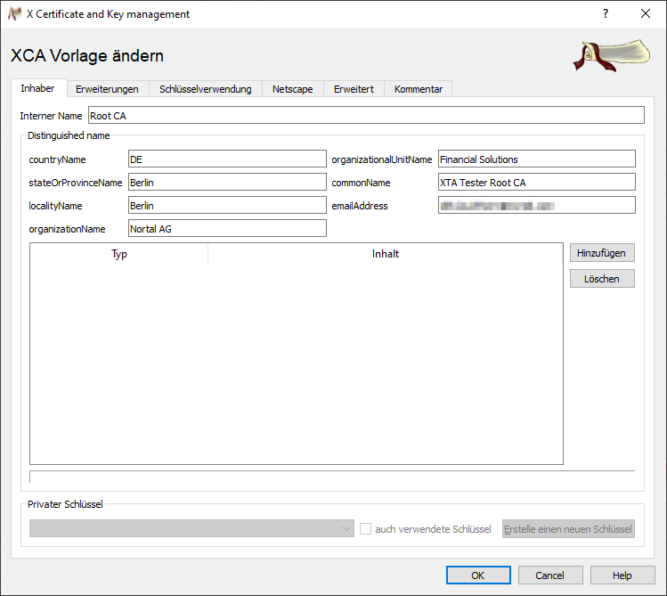

.Tab Erweiterungen
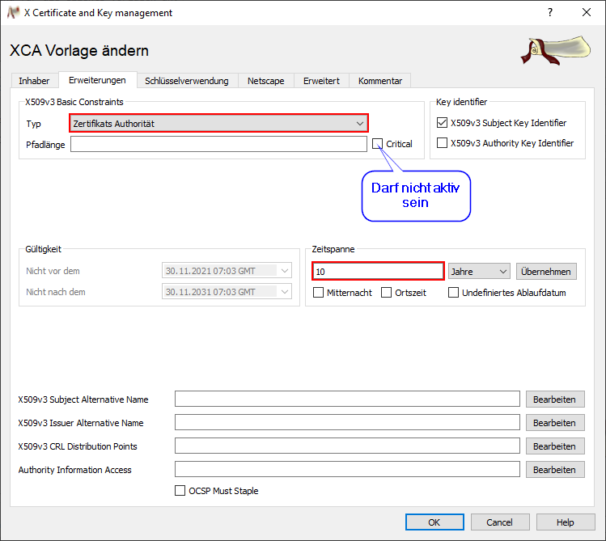

.Tab Schlüsselverwendung
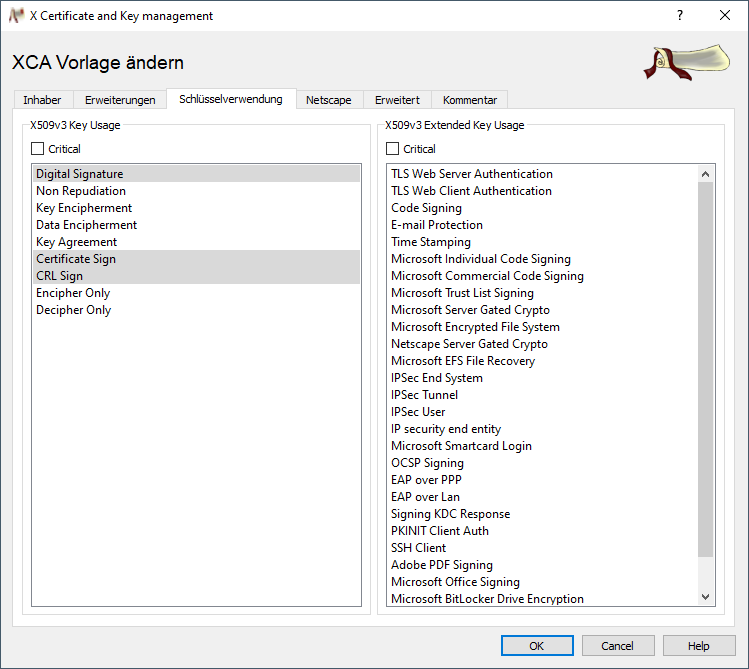

.Tab Netscape
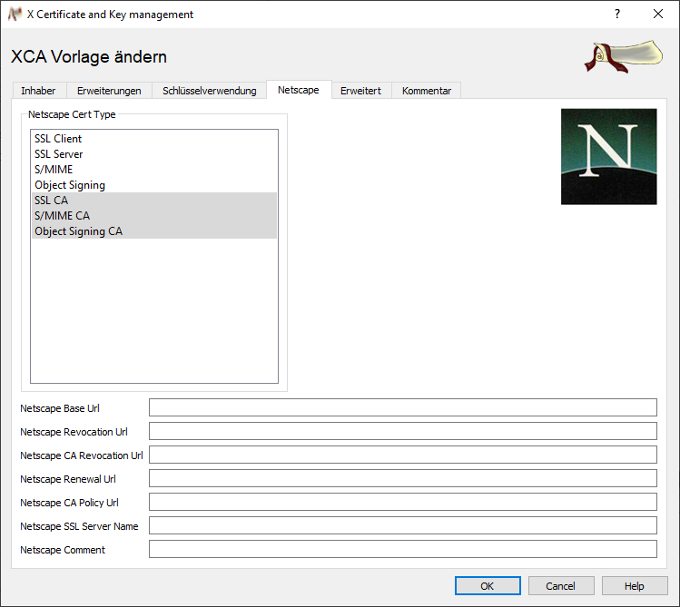

.Tab Erweitert
Hier sollte kein Text in rot enthalten sein.

.Tab Kommentar
Ein ggf. enthaltener Kommentar kann entfernt werden.

==== Vorlage für die Applikation

Im Tab Vorlagen den Button "Neue Vorlagen" wählen. Im Auswahldialog "[default] TLS_server" wählen.

Die Vorlage entsprechend der Screenshots ausfüllen.

.Tab Inhaber
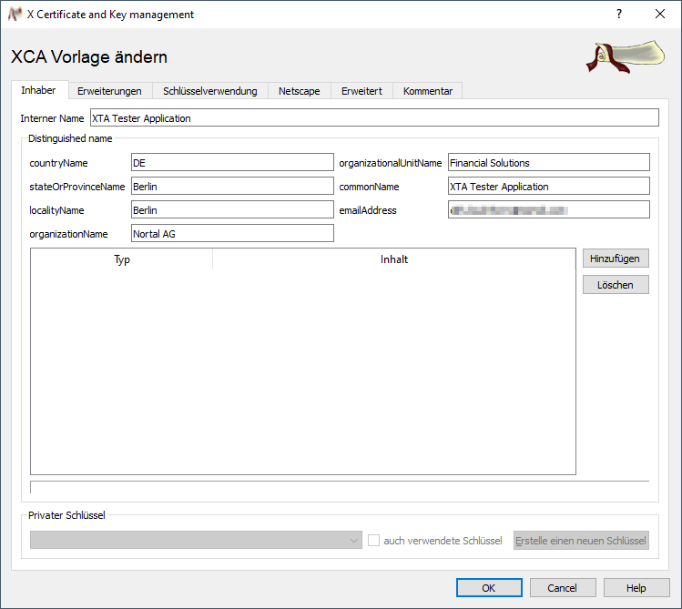

.Tab Erweiterungen
Unter "X509v3 Subject Alternative Name" alle alternativen DNS Namen eintragen (inkl. IPs). Wurde ein gültiger Domainname als "commonName" eingetragen,
dann kann dieser mit "DNS:copycn" übernommen werden.

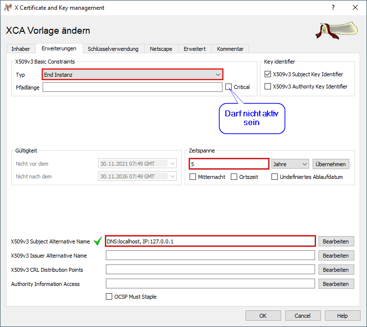

.Tab Schlüsselverwendung
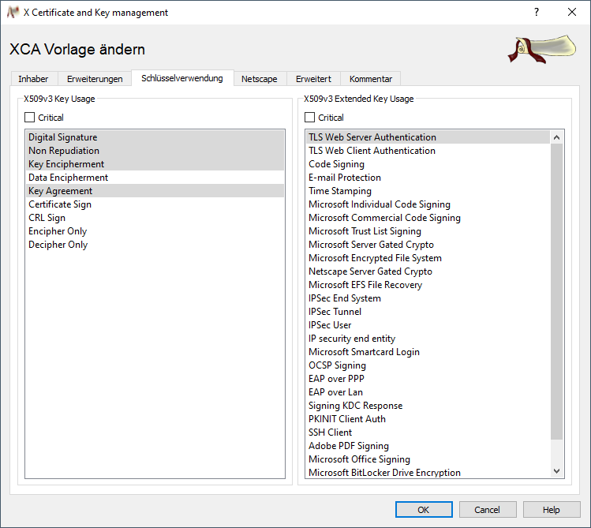

.Tab Netscape
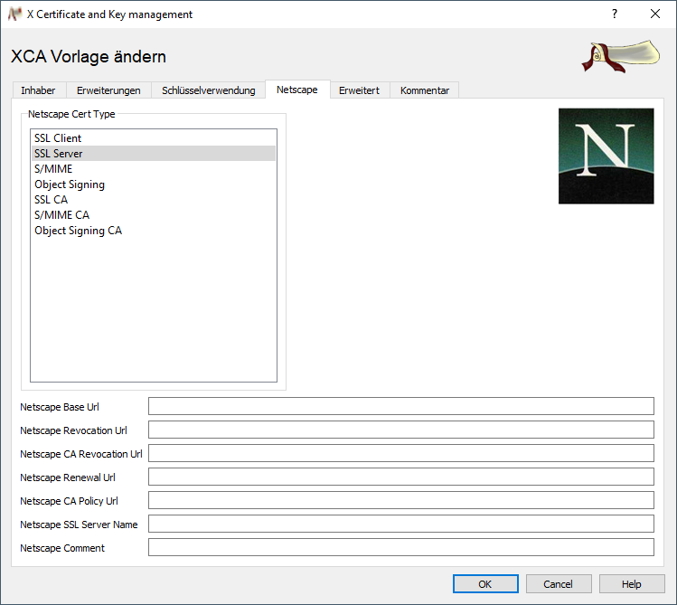

.Tab Erweitert
Hier sollte kein Text in rot enthalten sein.

.Tab Kommentar
Ein ggf. enthaltener Kommentar kann entfernt werden.

==== Vorlage für die Clients

Im Tab Vorlagen den Button "Neue Vorlagen" wählen. Im Auswahldialog "[default] TLS_client" wählen.

Die Vorlage entsprechend der Screenshots ausfüllen.

.Tab Inhaber
Im Feld "commonName" den Benutzernamen und in das Feld "emailAddress" dessen Email Adresse eintragen.

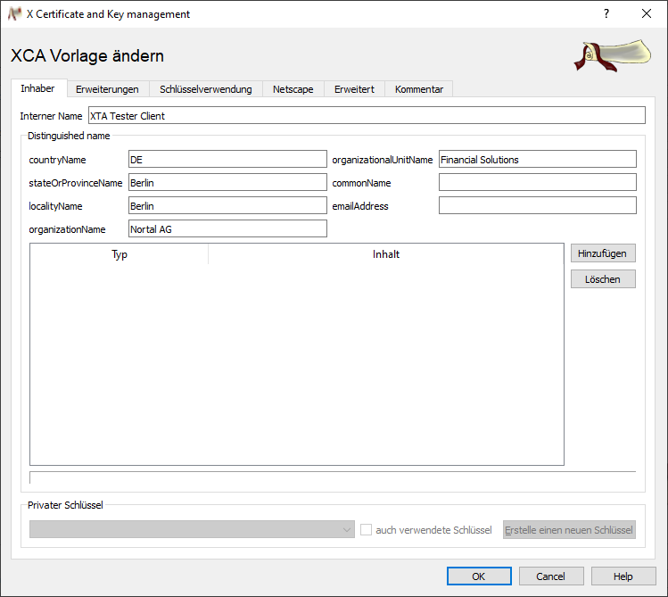

.Tab Erweiterungen
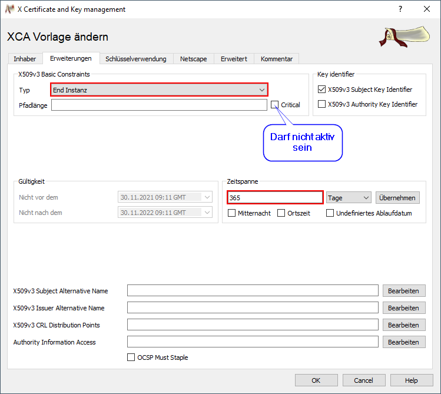

.Tab Schlüsselverwendung
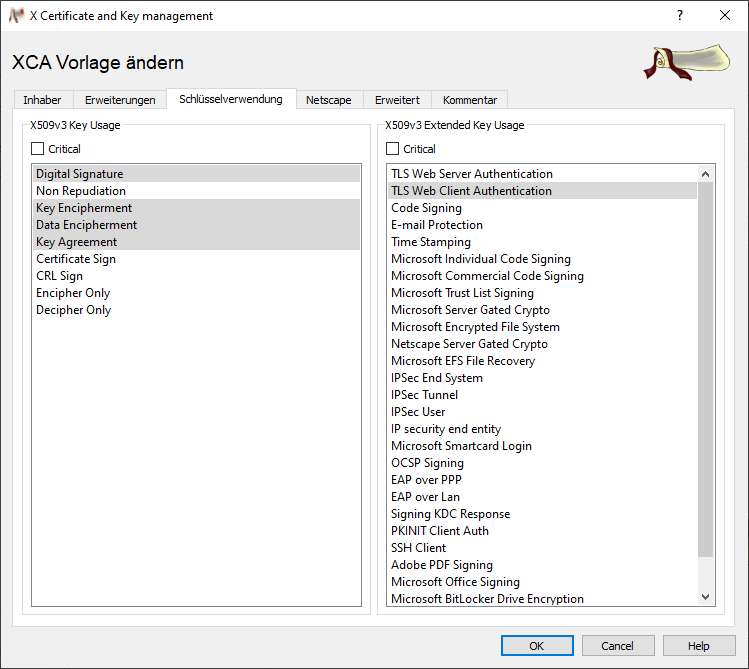

.Tab Netscape
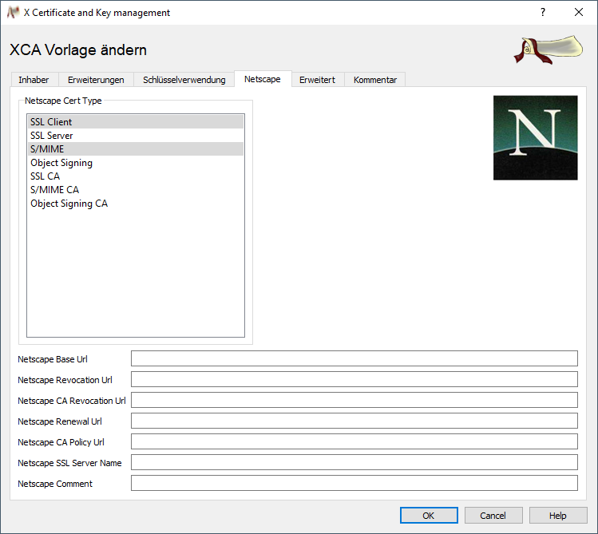

.Tab Erweitert
Hier sollte kein Text in rot enthalten sein.

.Tab Kommentar
Ein ggf. enthaltener Kommentar kann entfernt werden.

=== Erstellen der Zertifikate

==== Zertifikat der Root CA

Im Tab "Zertifikate" den Button "Neues Zertifikat" wählen.

Das Zertifikat entsprechend der Screenshots ausfüllen.

.Tab Herkunft
In der Auswahl "Vorlage für das neue Zertifikat" die Vorlage "Root CA" auswählen und anschließend auf den Button "Alles übernehmen" drücken.
Jetzt wurden alle Felder mit den Werten der Vorlage befüllt. 

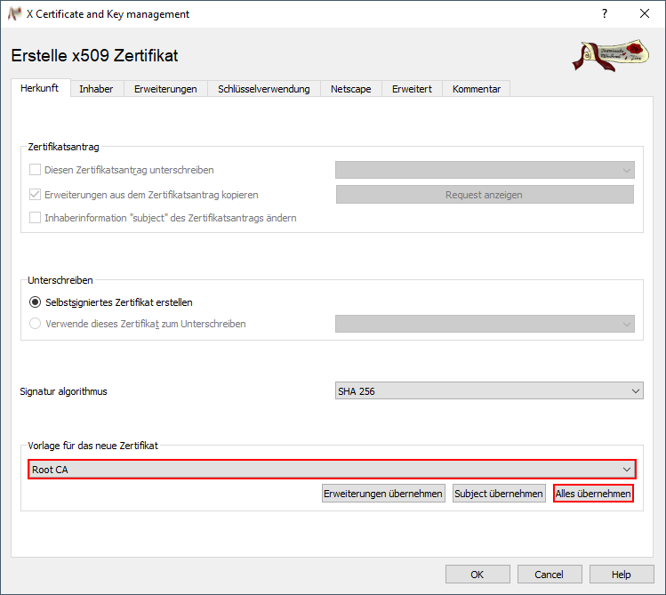

.Tab Inhaber
Zuerst im Feld "Interner Name" "XTA Tester Root CA" eintragen. Anschließend über den Button "Erstelle einen neuen Schlüssel" einen neuen Privaten Schlüssel erzeugen.

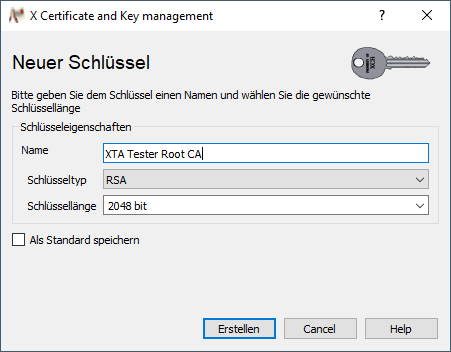

Nachdem der neue Schlüssel erstellt wurde sollte dieser im Auswahlfeld "Privater Schlüssel" automatisch ausgewählt sein.
 

Weitere Anpassungen sind nicht notwendig und das Zertifikat kann erstellt werden. 

==== Zertifikat der Applikation

Im Tab "Zertifikate" den Button "Neues Zertifikat" wählen.

Das Zertifikat entsprechend der Screenshots ausfüllen.

.Tab Herkunft
In der Gruppe "Unterschreiben" die Option "Verwende dieses Zertifikat zum Unterschreiben" wählen und die Root CA auswählen.
In der Auswahl "Vorlage für das neue Zertifikat" die Vorlage "XTA Tester Application" auswählen und anschließend auf den Button "Alles übernehmen" drücken.
Jetzt wurden alle Felder mit den Werten der Vorlage befüllt. 

.Tab Inhaber
Zuerst im Feld "Interner Name" "XTA Tester Application" eintragen. Anschließend über den Button "Erstelle einen neuen Schlüssel" einen neuen Privaten Schlüssel erzeugen.

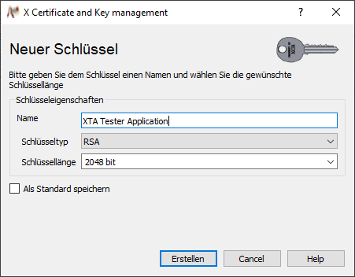

Nachdem der neue Schlüssel erstellt wurde sollte dieser im Auswahlfeld "Privater Schlüssel" automatisch ausgewählt sein.
 
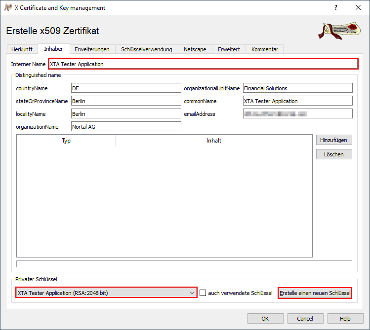

Weitere Anpassungen sind nicht notwendig und das Zertifikat kann erstellt werden. 

==== Zertifikat eines Clients

Im Tab "Zertifikate" den Button "Neues Zertifikat" wählen.

Das Zertifikat entsprechend der Screenshots ausfüllen.

.Tab Herkunft
In der Gruppe "Unterschreiben" die Option "Verwende dieses Zertifikat zum Unterschreiben" wählen und die Root CA auswählen.
In der Auswahl "Vorlage für das neue Zertifikat" die Vorlage "XTA Tester Client" auswählen und anschließend auf den Button "Alles übernehmen" drücken.
Jetzt wurden alle Felder mit den Werten der Vorlage befüllt. 

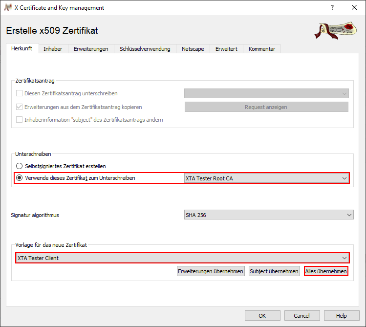

.Tab Inhaber
Zuerst im Feld "Interner Name" "XTA Tester Client [NAME]" eintragen und noch commonName und emailAddress ausfüllen. Anschließend über den Button 
"Erstelle einen neuen Schlüssel" einen neuen Privaten Schlüssel erzeugen.

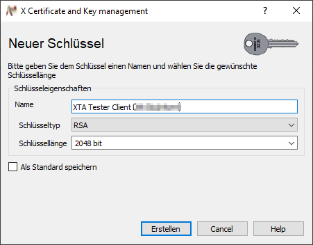

Nachdem der neue Schlüssel erstellt wurde sollte dieser im Auswahlfeld "Privater Schlüssel" automatisch ausgewählt sein.

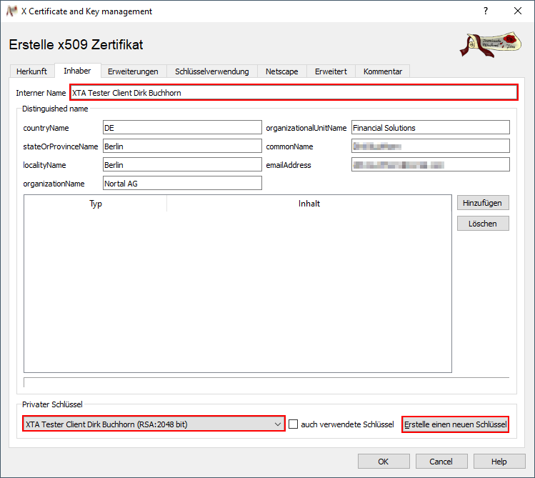

Weitere Anpassungen sind nicht notwendig und das Zertifikat kann erstellt werden. 

== Erstellen des Keystores

.Privaten Schlüssel der Applikation exportieren
In XCA in den Tab "Private Schlüssel" wechseln und den Schlüssel "XTA Tester Application" wählen. Über den Button "Export" öffnet sich ein Export-Dialog.
Den Schlüssel im "PEM" Format unter dem Dateinamen "XTA_Tester_Application.key.pem" exportieren.

.Zertifikat der Applikation exportieren
In XCA in den Tab "Zertifikate" wechseln und das Zertifikat "XTA Tester Application" wählen. Über den Button "Export" öffnet sich ein Export-Dialog.
Als Exportformat "PEM Kette" wählen und das Zertifikat unter dem Dateinamen "XTA_Tester_Application.pem" exportieren.

.Erstellen des Keystores mit dem KeyStore Explorer
Öffnen des *KeyStore Explorers* und einen neuen "PKCS #12" Schlüsselspeicher erzeugen. Anschließend "Schlüsselpaar importieren" wählen. Im sich öffnenden Dialog
"OpenSSL" wählen. Im folgenden Dialog die CheckBox "Verschlüsselter privater Schlüssel" deaktivieren und in die entsprechenden Felder den Pfad zum privaten Schlüssel
und dem Zertifikat eintragen. Nach dem Import als Alias "xta-tester-application" verwenden. Jetzt muss noch ein Passwort vergeben werden.
Zum Abschluss den Keystore noch speichern, auch hier ist ein Passwort anzugeben. Bitte das gleiche Passwort verwenden. Das vergebene Passwort ist später in der
application.yml Datei zu konfigurieren.

== Erstellen des Truststores

.Root CA exportieren
In XCA in den Tab "Zertifikate" wechseln und das Zertifikat "XTA Tester Root CA" wählen. Über den Button "Export" öffnet sich ein Export-Dialog.
Als Exportformat "PEM" wählen und das Zertifikat unter dem Dateinamen "XTA_Tester_Root_CA.crt" exportieren.

.Erstellen des Truststores mit dem KeyStore Explorer
Öffnen des *KeyStore Explorers* und einen neuen "JKS" Schlüsselspeicher erzeugen. Anschließend "Vertrauenswürdiges Zertifikat importieren" wählen. Im sich öffnenden Dialog
das exportierte Zertifikat auswählen und anschließend noch als Alias "XTA Tester Root CA" eintragen. Zum Abschluss den Truststore speichern. 

== Erstellen einer p12 Datei für einen Client

Es gibt zwei Möglichkeiten. 
Zum einen kann in XCA im Tab "Zertifikate" das Zertifikat inklusive privatem Schlüssel als
p12-Datei exportiert werden. Dabei ist es wichtig den Eintrag mit Zertifizierungskette zu wählen. 
Die zweite Möglichkeit ist den privaten Schlüssel und das Zertifikat getrennt zu exportieren und anschließend die p12-Datei mit dem KeyStore 
Explorer zu erzeugen.

.Privaten Schlüssel des Clients exportieren
In XCA in den Tab "Private Schlüssel" wechseln und den Schlüssel "XTA Tester Client [Name]" wählen. Über den Button "Export" öffnet sich ein Export-Dialog.
Den Schlüssel im "PEM" Format unter dem Dateinamen "XTA_Tester_Client_[NAME].key.pem" exportieren.

.Zertifikat des Clients exportieren
In XCA in den Tab "Zertifikate" wechseln und das Zertifikat "XTA Tester Client [Name]" wählen. Über den Button "Export" öffnet sich ein Export-Dialog.
Als Exportformat "PEM Kette" wählen und das Zertifikat unter dem Dateinamen "XTA_Tester_Client_[Name].pem" exportieren.

.Erstellen der p12 Datei mit dem KeyStore Explorer
Öffnen des *KeyStore Explorers* und einen neuen "PKCS #12" Schlüsselspeicher erzeugen. Anschließend "Schlüsselpaar importieren" wählen. Im sich öffnenden Dialog
"OpenSSL" wählen. Im folgenden Dialog die CheckBox "Verschlüsselter privater Schlüssel" deaktivieren und in die entsprechenden Felder den Pfad zum privaten Schlüssel
und dem Zertifikat eintragen. Nach dem Import als Alias "\[Name\] \(xta tester root ca\)" verwenden. Jetzt muss noch ein Passwort vergeben werden.
Zum Abschluss den Keystore noch speichern, auch hier ist ein Passwort anzugeben. Bitte das gleiche Passwort verwenden. Das Passwort wird benötigt wenn der Keystore auf
dem  Client eingespielt wird.

