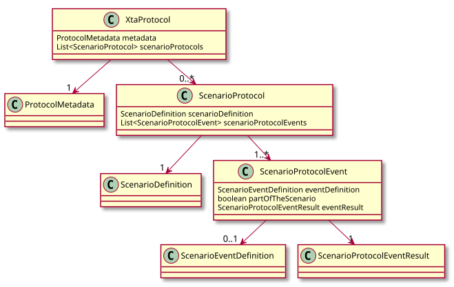

= Protokoll
:toc:
:toc-title: Inhalt
:toclevels: 3
:docinfo: shared

== Aufbau eines Protokolls

Testergebnisse werden in ein Protokoll geschrieben. Ein Protokoll enthält ein oder 
mehrere Szenarien-Protokolle. Jedes Szenarien-Protokoll enthält Ereignisse und deren 
Ergebnisse.

.UML Diagram Protokoll

