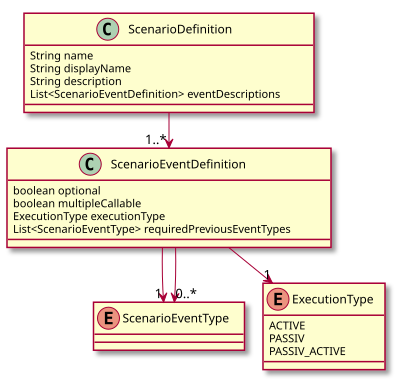
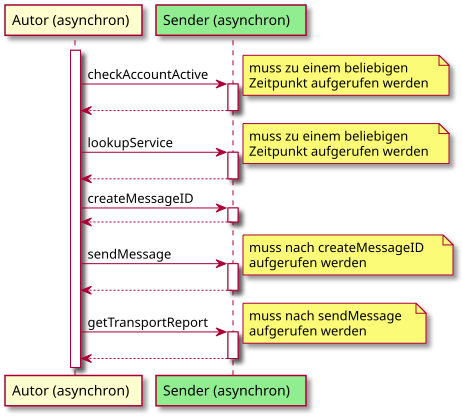
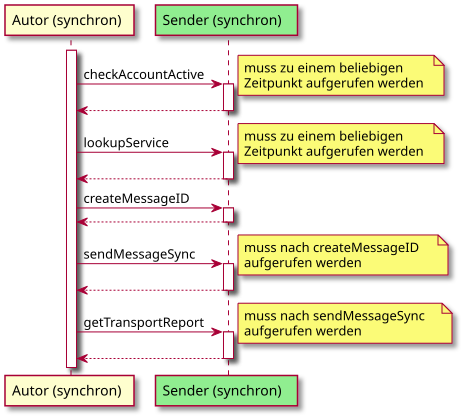
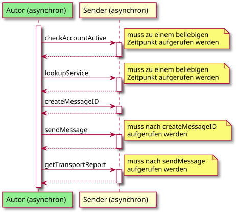
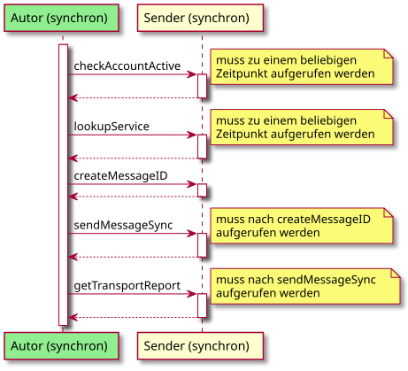
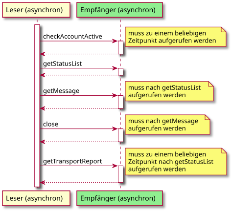
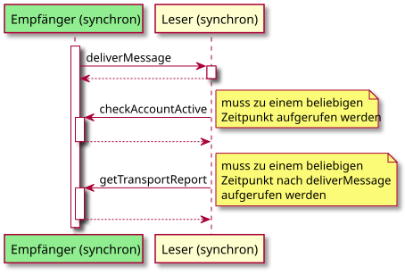
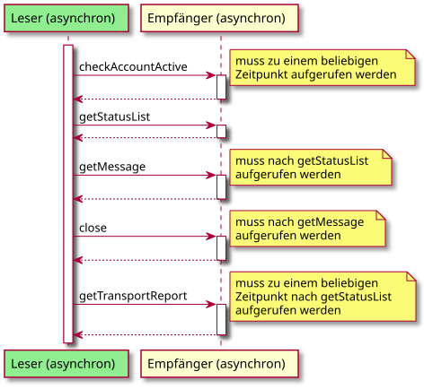
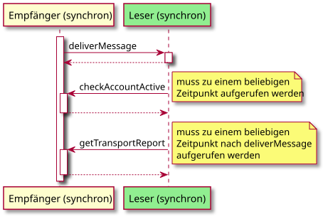

= Szenarien
:toc:
:toc-title: Inhalt
:toclevels: 3
:docinfo: shared

== Aufbau einer Szenariodefinition

Eine Szenariodefinition besitzt einen Namen, einen Anzeigenamen und eine Beschreibung.
Weiterhin enthält die Klasse eine Liste von Ereignisdefinitionen.
Eine Ereignisdefinition enthält den Ereignistyp, ob es optional ist, ob es mehrfach aufrufbar ist und welche Ereignistypen vorher eingetreten sein müssen.

.UML Diagram Szenariodefinition

== Definierte Szenarien

Die zu testende Rolle ist gelb und die Rolle der Testumgebung grün markiert.
Ist keine Einschränkung bei den Methoden in den Sequenzdiagrammen angegeben, dann ist die Aufrufreihenfolge egal.

=== Autor (asynchron)

Es wird die Rolle Autor (asynchron) getestet.
Der XTA Konformitätstester nimmt dabei die passive Rolle Sender (asynchron) ein.

.Sequenzdiagramm Autor (asynchron)

=== Autor (synchron)

Es wird die Rolle Autor (synchron) getestet.
Der XTA Konformitätstester nimmt dabei die passive Rolle Sender (synchron) ein.

.Sequenzdiagramm Autor (synchron)

=== Sender (asynchron)

Es wird die Rolle Sender (asynchron) getestet.
Der XTA Konformitätstester nimmt dabei die aktive Rolle Autor (asynchron) ein.

.Sequenzdiagramm Sender (asynchron)

=== Sender (synchron)

Es wird die Rolle Sender (synchron) getestet.
Der XTA Konformitätstester nimmt dabei die aktive Rolle Autor (synchron) ein.

.Sequenzdiagramm Sender (synchron)

=== Leser (asynchron)

Es wird die Rolle Leser (asynchron) getestet.
Der XTA Konformitätstester nimmt dabei die passive Rolle Empfänger (asynchron) ein.

.Sequenzdiagramm Leser (asynchron)

=== Leser (synchron)

Es wird die Rolle Leser (synchron) getestet.
Der XTA Konformitätstester nimmt dabei die aktive/passive Rolle Empfänger (synchron) ein.

.Sequenzdiagramm Leser (synchron)

=== Empfänger (asynchron)

Es wird die Rolle Empfänger (asynchron) getestet.
Der XTA Konformitätstester nimmt dabei die aktive Rolle Leser (asynchron) ein.

.Sequenzdiagramm Empfänger (asynchron)

=== Empfänger (synchron)

Es wird die Rolle Empfänger (synchron) getestet.
Der XTA Konformitätstester nimmt dabei die passive/aktive Rolle Leser (synchron) ein.

.Sequenzdiagramm Empfänger (synchron)

