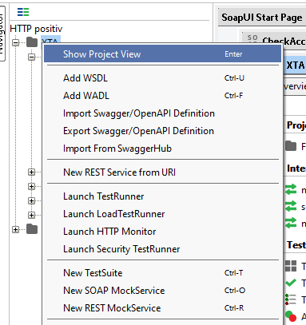
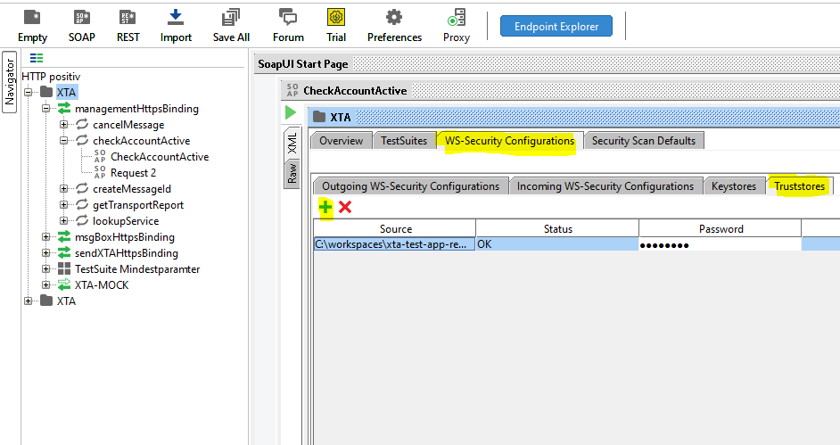

= Anleitung SoapUI
:toc:
:toc-title: Inhalt
:toclevels: 3
:docinfo: shared

== Vorwort

Das vorliegende SoapUI-Projekt beinhaltet exemplarische Methodenaufrufe und wird als nicht-normatives Hilfsmittel zur Verfügung gestellt. Das Hilfsmittel ist ein Teil des Projektes "XTA-2-Testumgebung" welches bei der Überprüfung der Konformität unterstützt. Der Umfang der genutzten Methoden/Parameter ist durch die Konformitätsvorgaben für XTA 2 Version 5 (Webservice 3.0.0) beschränkt.

Die XTA-2-Testumgebung, somit auch vorliegendes SoapUI-Projekt, ist ein Projekt der KoSIT und wurde im Auftrag durch die Nortal AG umgesetzt.

Bei technischen Rückfragen zum Projekt und Fehlerbefunden können Sie sich an xta2@nortal.com mit CC an kosit@finanzen.bremen.de wenden.

Bei weiteren Fragen, insbesondere Rückfragen zum Standard XTA, wenden Sie sich bitte an thomas.matern@finanzen.bremen.de oder kosit@finanzen.bremen.de.

== Voraussetzungen

Das Testprojekt benötigt das Programm SoapUI in mindestens der Version 5.7.0.

Für eine erfolgreiche Kommunikation sind im Normalfall ein Client-Zertifikat zur Authentifizierung und ein Server-Zertifikat für den Aufbau einer SSL/TLS-Verbidung notwendig. 
Sowohl ein Beispiel-Client-Zertifikat als auch ein Truststore mit dem Server-Zertifikat der XTA-2-Testumgebung sind dem Projekt beigelegt. Diese dienen der Kommunikation mit der XTA-2-Testumgebung und müssen ersetzt werden, sofern mit anderen Testsystemen/-anwendungen kommuniziert werden soll. Das Passwort für den Truststore und den Keystore ist "password".

Sofern zur Kommunikation mit dem zu testenden System die Client-Zertifikate zur Authentifizierung notwendig sind, müssen diese als p12/pfx-Datei vorliegen. Damit SoapUI die HTTPs-Verbindung jeweils mit dem Client-Zertifikat herstellt, muss dieses in den Einstellungen hinterlegt werden.

image:./images/soapui_cert.png["Notwendige Einstellungen für Client-Zertifikate in SoapUI"] 

Dieses Zertifikat wird anschließend für alle Requests genutzt.

Um eine verschlüsselte Kommunikation mit einem Server zu erlauben, der selbstsignierte Zertifikate nutzt, kann ein Truststore eingebunden werden. Innerhalb des Truststores wird hinterlegt, welchen Zertifikaten SoapUI beim Verbindungsaufbau vertrauen soll. Im Normalfall enthält dieser Truststore das Root-Zertifikat mit dem das Server-Zertifikat des Servers erstellt wurde. Der Truststore muss im Format Java Keystore (JKS) vorliegen. Die Einbindung kann über die Projektkonfiguration erledigt werden:

Innerhalb der Projektkonfiguration kann ein neuer Eintrag für den Truststore in dieser Ansicht erstellt werden:

== Ausführen

Innerhalb des SoapUI-Projekts gibt es für jede Methode einen Beispiel-Request. Die Requests kann mit eigenen Werten vervollständigt werden, um die eigene XTA-2-Implementierung mit passenden / benötigten Parametern (z.B. fachlich korrekte Nachricht) anzusprechen. 

== Haftungsausschluss

Das Projekt dient ausschließlich als Hilfsmittel für Implementierende. Es soll den Einstieg in den XTA Webservice durch das Aufzeigen von exemplarischen Methodenaufrufen vereinfachen. Das Projekt ist für die Nutzung innerhalb eigener Entwicklungsumgebungen mit eigenen Testdaten vorgesehen. Die Bereitstellung des Projekts erfolgt unter Ausschluss jeglicher Gewährleistung und Ausschluss jeglicher Haftung für eventuell durch die Benutzung enstehender Schäden.
